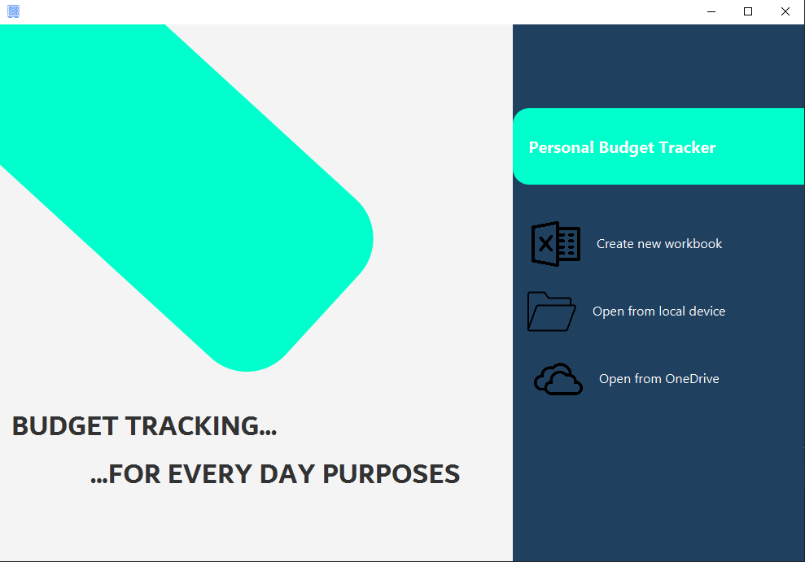
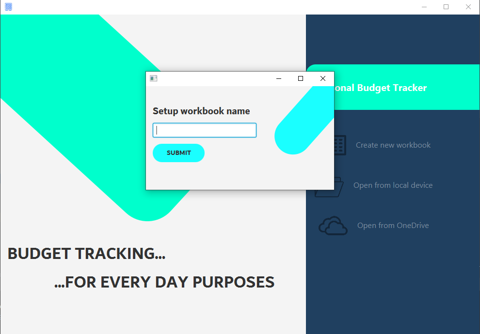
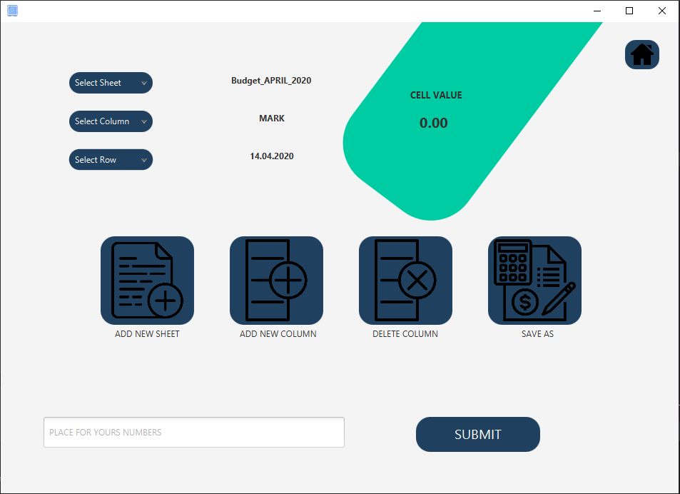

# NPRG013-Course-Project
Application for maintaing overview of personal budget in .xlsx files. 

## Purpose 
If you ever tried to track your expenses, you might get ot hte situation when still opening excel files 
and manualy selects particular cell, but accidently missed or used some unwanted functionality, which excel
provides in vast range. This idea is to make this tracking simplier. Due to the limitation of current Java
development knowledge I was limited to desktop window application. But in following course of advanced Java I 
tend to develop upgraded version, which would be web or mobile based and handling the tracking activities will
be smoother.


## Instalation step by step
**Prerequisities** 
- Installed **Java 11+**
- Installed **Git**
- Installed **Maven**

Download the repository on your local machine via command:
  ```
  git clone (https://github.com/MichalKyjovsky/NPRG013-Course-Project.git)
  ```
Once you have repository downloaded and prerequisities are fulfilled
you can move into the project root directory where ***pom.xml*** is located
and run the project via commands:
  ```
  mvn process-resources
  mvn compile
  mvn install
  mvn javafx:compile
  mvn javafx:run
  ```
  
After commands above were executed, landing page of the application will display.  


In current version of application are only features *Create new workbook* and *Open from local device* fully operational. 
Feature *Open from OneDrive* is partly included in *Open from local device* if you have your hard drive synchronized with 
your OneDrive account, but original intention, to grab your file from cloud directly was not finished and it is planned for 
web-based version of the application. 

If you press *Create new workbook*, new **.xlsx** will be created. As shown on images below you need to set name of the document
and initial tracking month. After this procedure patterned workbook will be created and scene view will change to the core layer 
of the application. Plese see attachment bellow. 
 
Name of the document must starts with **character and than numbers, underscores and dashes** are allowed


Initial Tracking months are indexed with **Integers 1-12**


Once you finish procedures above core view will display.


To core of the application you can get by *Open from local device* button on ***Landing Page***, but **be aware 
that program is designed for unified formatting as shown on attachment bellow, thus another formats are not accepted!**

When opening from local device, all *File Explorers* are implicitly set to your home directory so any dixcrepancy
between Windows and UNIX-like system users are eliminated.

As you can see on the picture, names of the sheets are concatenated by a pattern. Rows are calculated depending on your
choice of tracking month. 
[Excel](./Documentation/Excel.PNG)


Let's describe all those buttons. As you might observed they are all marked with description onf their functionality
so only bried overview will be provided. If you press on *ADD NEW SHEET* button, dialog demanding new tracking month will
be invoked (***be aware that in .xlsx cannot exist two same named sheets, because names are generated automatically 
depending on your input value, do not input same months again***). After that new sheet will be generated
and by selecting *Select Sheet* drop-down menu you can list bewtween yours sheets, your current chosen sheet will
be displayed in label horizontaly next to the *Select Sheet* drop-down menu, where initial *0* can be observed. 

When you press *ADD NEW COLUMN* button, dialog window demanding column name will be invoked. Same naming conventions as for
workbook name applies. Once you setup value new column will be added, column with **TOTAL** heading will be recalculated and moved
to one position left. Again you can choose by selecting from *Select Column* drop-down menu particular column.


  
  
